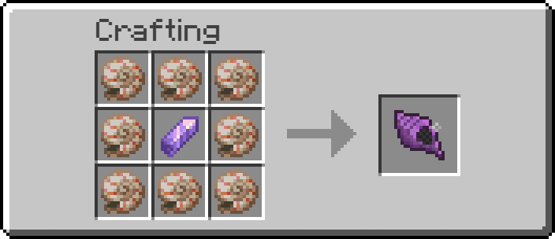
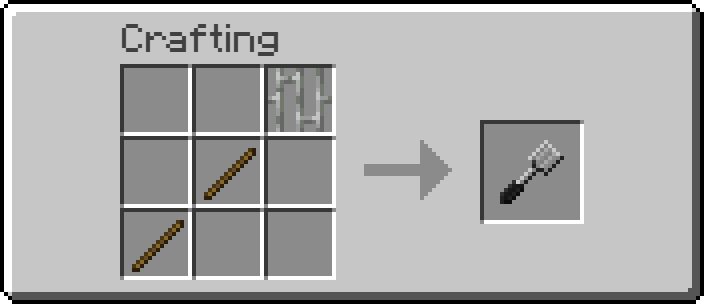
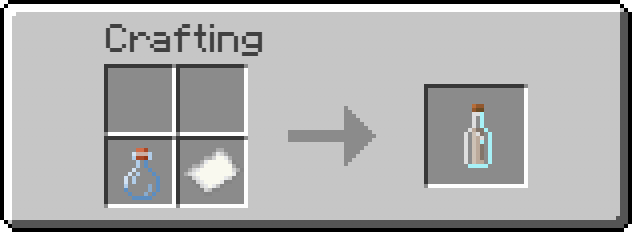
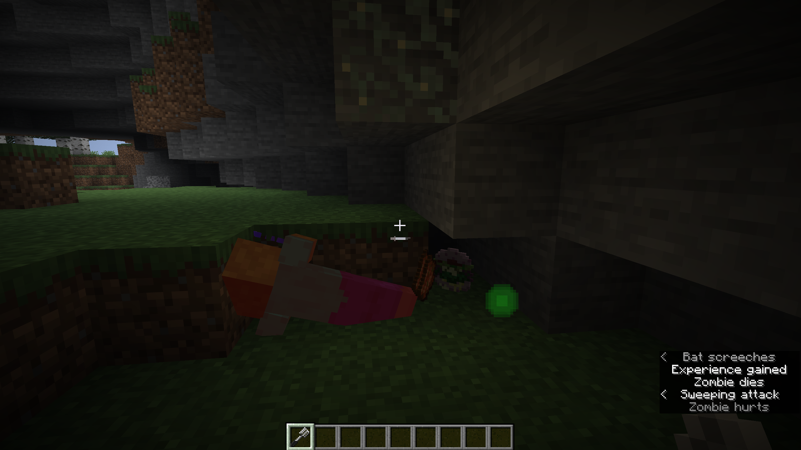
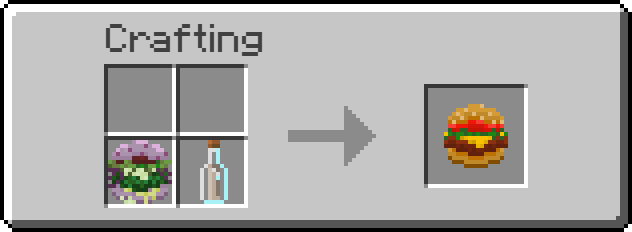
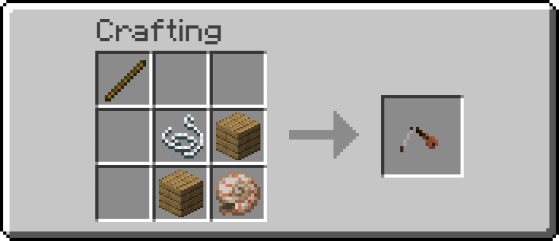
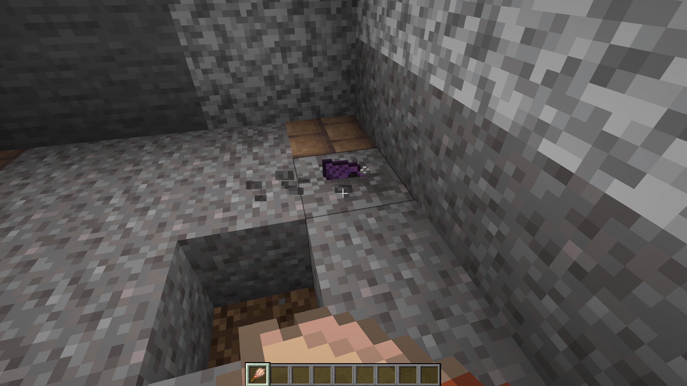
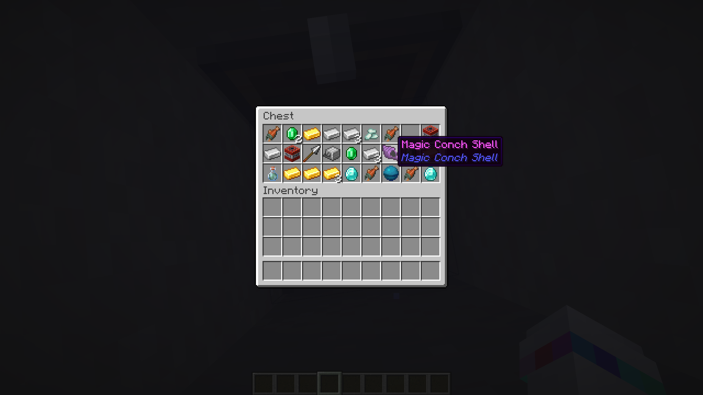
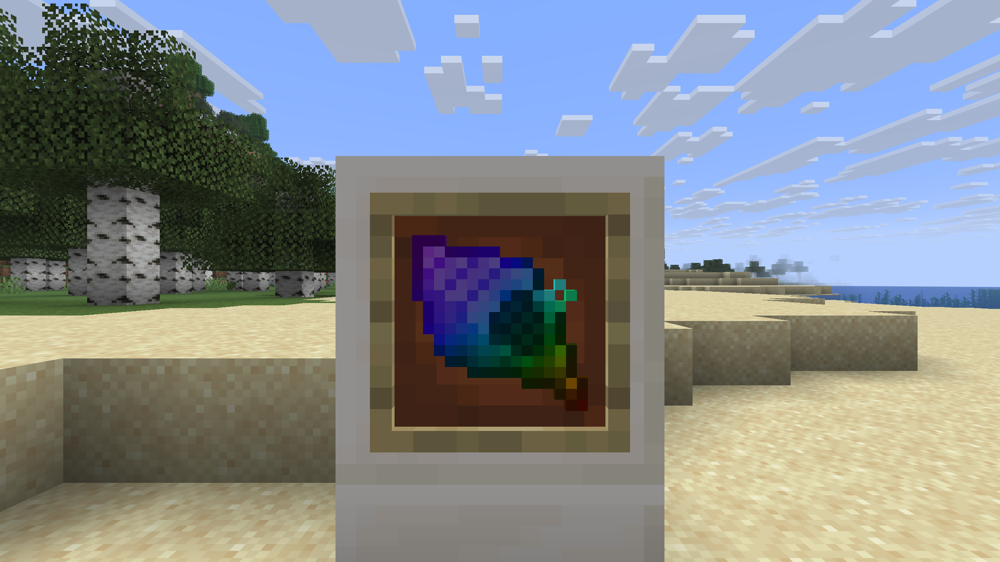
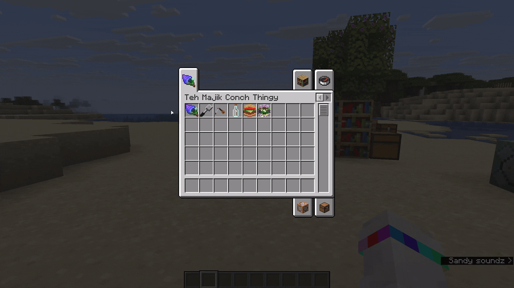

<h1></h1>

A SpongeBob inspired Fabric mod that adds the Magic Conch Shell and several themed items to Minecraft.

## What this mod adds

Magic Conch Shell adds a small collection of SpongeBob inspired items, sounds, and gameplay features:

- **Magic Conch Shell**  
  Ask the shell a question and receive one of 11 random answers.  
  The item has a short drumroll style use animation, plays a custom sound, and uses durability when activated.

- **Krabby Patty**  
  A powerful food item that restores 10 hunger points and provides high saturation.

- **Nasty Patty**  
  A dangerous food item with poor nutrition that also applies poison, hunger, and nausea.

- **Spatula**  
  A weapon based on an iron sword. It is also required to obtain Nasty Patties from undead enemies.

- **World's Smallest Violin**  
  A fun utility item that plays its own custom sound effect when used.

- **Secret Formula**  
   An ingredient item that can be used to craft a Krabby Patty.

- **Custom advancements**  
  A small set of themed advancements that track your progress with the Magic Conch Shell and its related items.

- **Mod Menu config screen support**  
  The mod includes a simple config that lets you toggle certain features, either via an in game config screen (when modmenu is installed) or through the config file.

All items are integrated into survival gameplay through loot tables and crafting recipes.

## Supported languages

The mod currently includes support for:

- English
- German
- Kölsch/Ripoarisch
- Piratespeak
- Lolcatz

## Magic Conch Shell

The Magic Conch Shell is the main item of this mod.

It can be used to ask the shell a question. After a short drumroll moment, it displays one random answer directly on screen and plays a custom sound.

### Where to find it

You can get the Magic Conch Shell in several ways:

- Guaranteed in **Buried Treasure**
- Possible from **Shipwreck Treasure**
- Possible from **Underwater Ruins**
- Possible from **Fishing Treasure**
- Possible from **Trail Ruins**
- Small chance from killing a **Nautilus**

### Crafting recipe

The Magic Conch Shell can also be crafted with 8 Nautilus Shells and 1 Amethyst Shard.

## Items and progression

### Spatula

The Spatula is a sword like weapon and can be crafted with 2 Sticks and 1 Iron Bars.

### Secret Formula

The Secret Formula is crafted using a shapeless recipe with a Glass Bottle and 1 Paper.

### Nasty Patty

The Nasty Patty cannot be crafted directly. Instead, it drops from undead mobs when the player kills them using the Spatula.

This includes multiple undead variants such as Zombies, Zombie Villagers, Drowned, Husks, Camel Husks, Zoglins, Zombie Horses, Zombie Nautiluses and Zombified Piglins.

Effects of eating a Nasty Patty:

- Poison II for 60 seconds
- Hunger III for 15 seconds
- Nausea for 15 seconds

### Krabby Patty

A Krabby Patty is made by combining a Nasty Patty with the Secret Formula.

Food values:

- 10 hunger
- 1.0 saturation

## World's Smallest Violin

The World's Smallest Violin is a fun item that plays a custom sound effect when used.
It uses a horn style animation and has a short cooldown before it can be used again.

It can be crafted with a Stick, a String, 2 Planks and a Nautilus Shell.

## Gallery

The Magic Conch Shell found in a trail ruin

The Magic Conch Shell found in a buried treasure chest

The Magic Conch Shell with pride textures (can be disabled in the config screen/file)

Supports multiple languages (English, German, Kölsch/Ripoarisch, Piratespeak, Lolcatz)

## Community

- [Code of Conduct](docs/CODE_OF_CONDUCT.md)
- [Contributing Guide](docs/CONTRIBUTING.md)
- [Security Policy](docs/SECURITY.md)